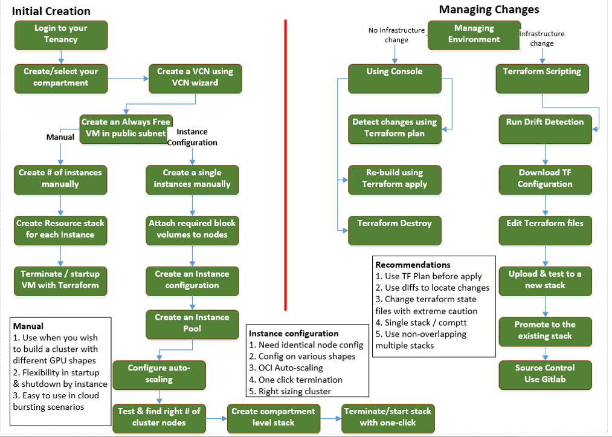

<!-- Copyright (c) 2020-2021, Oracle and/or its affiliates -->

## Automation setup and management workflow

This page describes Automation setup and management workflow for researchers. 

### Setup workflow 

#### Features 
1. Automation through OCI Resource stacks
2. Discusses - Initial creation and managing changes
3. Manual cluster creation
4. Cluster node creation through Instance configuration and pooling
5. Instance pooling and auto-scaling configurations
6. Reverse-engineering from a compartment objects to a reasource stack and Terraform
7. Starting and stopping an environment using Terraform
8. Starting and stopping an environment using OCI CLI
9. Infrastructure changes and running drift detection reports
10. Downloading Terraformn configuration
11. Editing and uploading Terraform configuration to a new / existing stack 
12. Advanced use case: Using source control through Gitlab

#### How to build
1. **Initial build (Common steps)** - 
   * Login to your tenancy
   * Create / select your compartment
   * Create a VCN in the compartment using the VCN create wizard
   * Create an always free VM in the public subnet
   * **Manual build**
     * Create the number of nodes you require manually
     * Nodes can be of different GPU shapes if needed
     * Create a resource stack for each instance
     * This would help terminate or startup instance at will with Terraform stack
     * Track drift changes at the node level
   * **Instance configuration and pooling**
     * Create a single compute instance manually in the compartment
     * Attach required block volume to the instances
     * Create an instance configuration
     * Create an instance pool 
     * Create an auto-scaling configuration
     * Test sample workload to right size the number of nodes
   * Reverse engineer to generate a compartment level resource stack
   * Destroy environment with one-click using Terraform
2. **Managing changes** - 
   * **No Infrastructure changes**
     * Use OCI console
     * Detect changes using Terraform plan
     * Re-build using Terraform apply
     * One-click destroy using Terraform destroy
   * **Infrastructure changes**
     * Code changes with Terraform scripting
     * Download Terraform configuration
     * Change only the core.tf files
     * Edit terraform files with notepad++ or Atom
     * Upload and test the changes with Terraform plan
     * Apply changes with Terraform apply
   
#### Recommendations
1. **Initial manual build**
   * Use when you wish to build a cluster with different GPU shapes
   * Flexibility in startup & shutdown by instance
   * Easy to use in cloud bursting scenarios
2. **Instance configuration and scaling**
   * Need identical node config
   * Config on various shapes
   * OCI Auto-scaling
   * One click termination
   * Right sizing cluster
3. **Managing through Terraform stacks**
   * Use TF Plan before apply
   * Use diffs to locate changes
   * Change terraform state files with extreme caution
   * Single stack / comptt
   * Use non-overlapping multiple stacks
