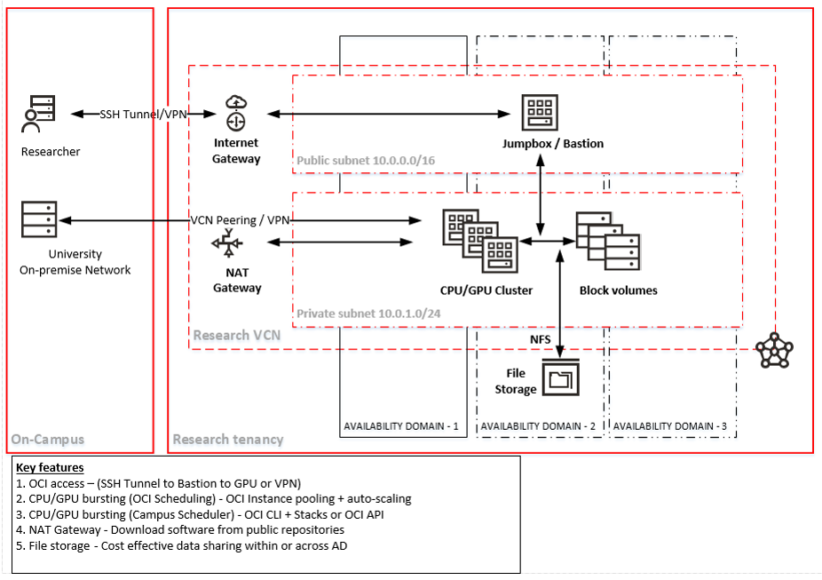

<!-- Copyright (c) 2020-2021, Oracle and/or its affiliates -->

## Implementing Cloud bursting Architecture for Researchers

This page describes the cloud bursting architecture for researchers. 

### Architecture 

#### Features 
1. Features a standard setup with the exception of direct VPN connection between on-premise and Oracle cloud
2. OCI access is through a Gateway VM / Jumpbox / Bastion
3. CPU/GPU clusters are built in the private subnet
4. NAT Gateway is used to pull down software from internet or from campus
5. File storage can be used for cross availability domain data sharing

#### How to build
1. Build as a standard architecture configuration
2. Implement startup / termination automation in Research Gateway VM
3. Burst statically (using canned Terraform scripts)
4. Burst dynamically (using integrated API calls) 
   a. Burst through on-premise scheduler through OCI API calls
   b. Burst through on-cloud Research Gateway VM through OCI CLI calls

#### Recommanded scenarios
1. A percentage of the workload can be run on Oracle cloud
2. Infrequent cloud usage
3. On-premise workload scheduling
4. On-premise cluster is overloaded
5. Reduce workload by moving an application/data to OCI
6. Smaller computational data sets
7. Performance benchmarking against on-campus / other clouds
8. Scheduling automation is tested and working
9.  Containerized applications & canary testing
10. Benchmarking against OCI shapes
11. Embarrassingly parallel HPC jobs

#### Not recommended scenarios
1. Large data migration during bursting
2. Tightly-coupled apps (Cross node communication)

