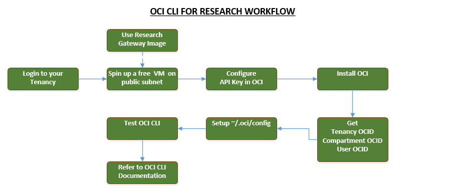
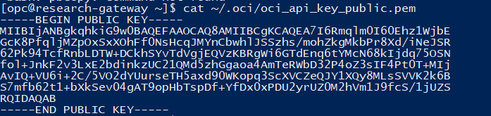

<!-- Copyright (c) 2020-2021, Oracle and/or its affiliates -->

## Setting up OCI Command line interface (CLI) for Researchers

By Rajib Ghosh, Senior Solutions Architect, Oracle for Research

This document outlines the basic and the necessary steps to set up the OCI command line interface for Oracle for Research. Since most researchers need basic automation steps I,e starting and stopping instances, standing up and terminating clusters, the document focusses on to get them started and show the learning path required for advanced options. This requires a researcher be familiar with spinning up a compute instance and logging in to the VM as opc account with SSH credentials. Key steps are illustrated below

### Pre-requisites
* Oracle Linux 7.8 / Oracle Linux 8 platform image
* Successful SSH to the compute instance

### Workflow


### Installing OCI CLI
1.	Spin up a compute instance with Oracle 7.8 / Oracle 8 Linux image with an Always Free Tier shape
2.	Follow the link to perform a yum install of OCI CLI as shown below based on the image you selected
https://docs.cloud.oracle.com/en-us/iaas/Content/API/SDKDocs/cliinstall.htm 
3.	After successful install, go ahead and generate the API signing key as shown below from the opc account or whichever account you would be working
```sh
mkdir ~/.oci
openssl genrsa -out ~/.oci/oci_api_key.pem 2048  # passphrase (recommended) 
chmod go-rwx ~/.oci/oci_api_key.pem               # Change permission on the key
openssl rsa -pubout -in ~/.oci/oci_api_key.pem -out ~/.oci/oci_api_key_public.pem             # Create a public key
cat ~/.oci/oci_api_key_public.pem     # cat the public key and copy it to clipboard 
```



4.	Get the key fingerprint 

```
openssl rsa -pubout -outform DER -in ~/.oci/oci_api_key.pem | openssl md5 -c
```

5.	Get the Tenancy OCID and User’s OCID (following the link) and upload the public key
https://docs.cloud.oracle.com/en-us/iaas/Content/API/Concepts/apisigningkey.htm 

6.	Create the python virtual environment based on the python environment

```
python3.6 -m venv oracle-cli
source oracle-cli/bin/activate
pip install --upgrade pip
```

7.	Download OCI CLI from github
Check for latest release under 'Assets' in https://github.com/oracle/oci-cli/releases/latest - for example:

```
wget https://github.com/oracle/oci-cli/releases/download/...
```

8.	Install OCI CLI 
(Refer - https://docs.cloud.oracle.com/en-us/iaas/Content/API/SDKDocs/climanualinst.htm)

```
pip install oci-cli
```

9.	Setup OCI CLI Resource files 

```
oci setup oci-cli-rc --file ~/.oci/oci-cli-rc
```

10.	Set up the OCI CLI config file in vi ~/.oci/config and populate with the following 

```
[DEFAULT]
user=ocid1.user.oc1..<unique_ID>
fingerprint=<your_fingerprint>
key_file=~/.oci/oci_api_key.pem
tenancy=ocid1.tenancy.oc1..<unique_ID>
region=us-ashburn-1

[ADMIN_USER]
user=ocid1.user.oc1..<unique_ID>
fingerprint=<your_fingerprint>
key_file=keys/admin_key.pem
pass_phrase=<your_passphrase>
```

11.	Set up permissions for the OCI CLI config file 

```
oci setup repair-file-permissions --file /home/opc/.oci/config
```

12.	Test OCI CLI 

```
oci os ns get
```

13.	Refer to CLI environment variables setup 
https://docs.cloud.oracle.com/en-us/iaas/Content/API/SDKDocs/clienvironmentvariables.htm#CLI_Environment_Variables

14.	For OCI CLI command reference 
https://docs.cloud.oracle.com/en-us/iaas/tools/oci-cli/2.14.1/oci_cli_docs/ 

### Using the Research Gateway custom image

You may be able to use an Oracle for Research custom image to standup a gateway VM. The image is pre-installed with OCI CLI on OracleLinux7.8 and you would only need it to configure with your tenancy ocid, compartment ocid and user ocid in ~/.oci/config file 

1.	Import the image to your tenancy as a custom image using the following URL – 
2.	Create the Always Free Tier compute instance with this custom image in the public subnet
3.	SSH to the instance ( ssh -i <pvt key> opc@<public IP> )
4.	Run – oci os ns get 
5.	You should receive a json output of the OCI namespaces in your tenancy
6.	This concludes a successful installation of OCI CLI

### What’s next? 

1.	If you are familiar with Linux bash scripts or if not learn the basics of Linux bash shell script
2.	You may use any Linux tutorial to learn shell scripting
3.	Refer to the [OCI CLI command line documentation](https://docs.cloud.oracle.com/en-us/iaas/tools/oci-cli/2.14.1/oci_cli_docs/) to try and test out OCI CLI 
4.	Use OCI CLI from the Research-Gatway VM to start / stop your instances / cluster
5.	Use operating system tools or OCI telemetry to remotely monitor cluster usage
6.	Shutdown VM / instance pool based on usage characteristics

NOTE : Oracle for Research would have an enhanced version of the image with start / stop scripts and instructions. However, OCI generic direction being with Terraform scripting is encouraged.

### Reference links
**Github and documentation**
1. [OCI- CLI Documentation](https://docs.cloud.oracle.com/en-us/iaas/tools/oci-cli/2.14.4/oci_cli_docs/cmdref/resource-manager.html)
2. [OCI Documentation](https://docs.cloud.oracle.com/en-us/iaas/Content/API/Concepts/cliconcepts.htm)
3. [Quickest way to install / configure OCI-CLI (support access required)](https://support.oracle.com/epmos/faces/DocumentDisplay?_afrLoop=210726212199712&parent=EXTERNAL_SEARCH&sourceId=BULLETIN&id=2432759.1&_afrWindowMode=0&_adf.ctrl-state=z1syd1md1_4)
4. [Oracle OCI-CLI github page](https://github.com/oracle/oci-cli) 
5. [OCI-CLI scripts collections and examples](https://www.oc-blog.com/oci-scripts-and-example-code/)
* OCI reporting tool and extensions
* Usage and cost reporting
* Auto-scaling 
* Universal credit balance & usage consumption
* Using Telemetry service with Grafana 
* Nightly stop script
* Audit script with OCI CLI Audit logs 
* Autonomous databases, DB systems with OCI-CLI

**OCI-CLI blogs**
1. [Introduction to CLI, API and OCI Data integration](https://blogs.oracle.com/dataintegration/introduction-to-cli%2c-api-for-oracle-cloud-infrastructure-oci-data-integration)
2. [Easy provisioning with OCI-CLI](https://blogs.oracle.com/linux/easy-provisioning-of-cloud-instances-on-oracle-cloud-infrastructure-with-the-oci-cli)
3. [Using OCI-CLI with Kubernetes cron-jobs](https://blogs.oracle.com/cloudnative/scheduling-oci-cli-commands-to-run-via-a-kubernetes-cronjob)
4. [Quickly run OCI-CLI with Docker container](https://blogs.oracle.com/developers/get-going-quickly-with-command-line-interface-for-oracle-cloud-infrastructure-using-docker-container)
5. [OCI-CLI with a federation from a Docker container](https://www.ateam-oracle.com/using-the-oci-cli-with-a-federated-user-from-a-docker-container-or-over-ssh)
6. [Deploying a microservice to Oracle cloud with Github actions](https://blogs.oracle.com/developers/adventures-in-cicd-4-deploying-a-microservice-to-the-oracle-cloud-with-github-actions-oci-cli-edition)
7. [New packages for OCI-CLI/GlusterFS , Terraform](https://blogs.oracle.com/wim/new-packages-added-to-oracle-linux-oci-sdkcli%2c-more-epel-packages%2c-glusterfs-server%2c-terraform%2c)
8. [Automated CLI scripts to scale autonomous databases](https://www.ateam-oracle.com/automated-cli-scripts-to-scale-autonomous-database-cpus)
9. [Using CLI with Restricted object store buckets](https://blogs.oracle.com/cloud-infrastructure/use-the-cli-with-restricted-object-storage-buckets)
