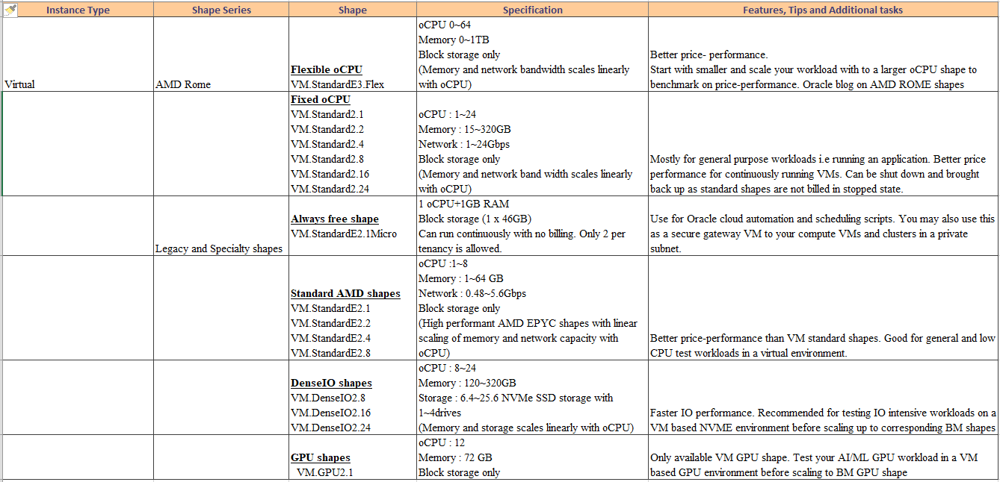
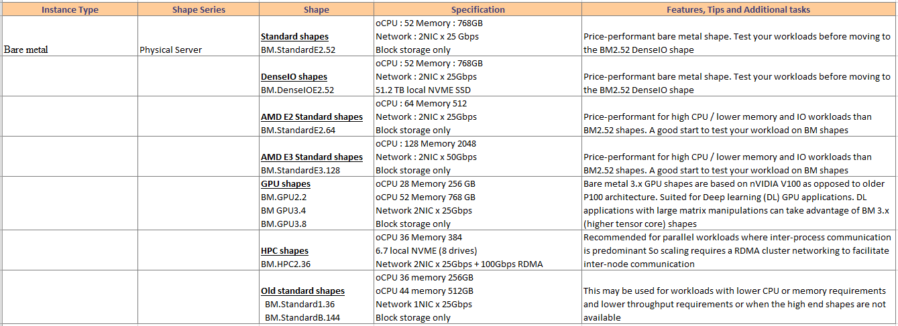
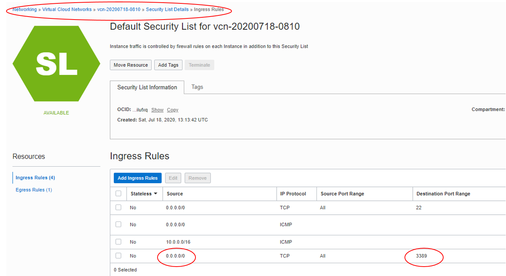
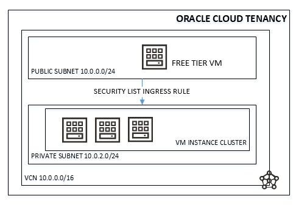

<!-- Copyright (c) 2020-2021, Oracle and/or its affiliates -->

# Important Considerations for setting up an Oracle Cloud Instance

By Rajib Ghosh - Senior Solutions Architect, Oracle for Research

Understanding the basics of setting up an Oracle Cloud tenancy and instance can help researchers and the technology specialists get running quickly. However, taking a moment to understand some additional details
can help optimize your use of Oracle Cloud. We encourage you to consider the following points when setting up an Oracle cloud instance.

A compute instance can be virtual machine (VM) or a physical bare metal machine (BM). Here, we explain the key considerations for setting up a compute instance.

- Compute images
- Instance shapes
- Network tiers and security lists
- Usage control, automation and credits

## Compute images

A compute image is a template of a virtual hard drive that determines the operating system and other software for an instance. Oracle cloud provides the following types of images:

1. Platform images: These are pre-built Linux or Windows operating system images ready to be deployed in the Oracle cloud. Platform images are tested by Oracle against various hardware shapes and are optimized to perform on Oracle cloud. Each image comes with multiple release builds to choose from. This is available as advanced option for compute instance creation. Platform image for [ARM based devices](https://archlinuxarm.org/#:~:text=Our%20collaboration%20with%20Arch%20Linux,and%20responsibility%20over%20the%20system.) is available through Oracle Linux 8 image.

    - TIP: Choose pre-built platform images while starting your project. If you software configurations are not closely tied to a Linux distribution like Centos or Ubuntu, we recommend using Oracle Linux. This has certain maintenance, security and compatibility advantages such as automated patching over other releases on Oracle cloud. You can convert your current Linux distributions to Oracle Linux quickly with [this link](https://linux.oracle.com/switch/centos/). Also, note that windows images cannot be exported out of the Oracle cloud tenancy because of Microsoft licensing considerations and you may need to take a backup of your installed software and data and export them out.

2. Oracle images: These are pre-built images created by Oracle with software tools pre-installed in them. They are tested for software version compatibilities against the OS version and are installed with latest patches. They are also tested against relevant sample data. They are designed to jump-start research projects and deliver a common image framework for researchers within and across universities. Some of the popular HPC (High performance computing) and Data science images are listed below:

    1. [AI (All-in-One) GPU Image for Data
        Science](https://console.us-ashburn-1.oraclecloud.com/marketplace/application/78643201/usageInformation)
    2. [Genome analysis
        toolkit](https://console.us-ashburn-1.oraclecloud.com/marketplace/application/81390072/usageInformation)
    3. [Julia AI/HPC GPU
        Image](https://console.us-ashburn-1.oraclecloud.com/marketplace/application/79537675/usageInformation)
    4. [NVIDIA images and NVIDIA GPU
        image](https://console.us-ashburn-1.oraclecloud.com/marketplace/application/54854361/usageInformation)

- TIP: You may use the following steps to determine whether you need to use an Oracle provided image or build your own from scratch.

    a. Compare the toolset and the version provided by Oracle image with the toolsets and version you require. Oracle images usually provides
    latest compatible working software versions with patches applied. Also, Oracle images are tested and benchmarked against relevant
    shapes with representative sample data. Check to see if this is advantageous and works for your scenario.

    b. If the tools and versions required are very specific and have a much
    lesser footprint than the Oracle image, it is better to start from the closest operating system image.

    c. Consult with Oracle for Research or Oracle cloud technical team for a solution that works best for your scenario.

3. Cloud marketplace images: These are [Oracle cloud partner images](https://cloudmarketplace.oracle.com/marketplace/en_US/productHomePage) developed by various third party vendors. These images can be directly provisioned to your Oracle cloud tenancy from the marketplace without any download. Some marketplace images of interest to researchers are included below:

    1. [Oracle HPC
        Cluster](https://cloudmarketplace.oracle.com/marketplace/en_US/listing/67628143)
        and [Oracle HPC File
        system](https://cloudmarketplace.oracle.com/marketplace/en_US/listing/75560175)
    2. [NVIDIA GPU Cloud machine
        image](https://cloudmarketplace.oracle.com/marketplace/en_US/listing/54854361)
    3. [Oracle Linux 7 Cluster Networking
        Image](https://cloudmarketplace.oracle.com/marketplace/en_US/listing/63394796)
    4. Molecular dynamics images ( [NAMD
        runbook](https://github.com/oci-hpc/oci-hpc-runbook-namd) and
        [GROMACS
        runbooks](https://github.com/oci-hpc/oci-hpc-runbook-gromacs))
    5. [Oracle marketplace slurm image (HPC + Slurm
        combo)](https://cloudmarketplace.oracle.com/marketplace/en_US/listing/67628143)
    6. [Oracle cloud slurm
        image](https://github.com/oracle-quickstart/oci-slurm)
    7. [BeeGFS on
        demand](https://cloudmarketplace.oracle.com/marketplace/en_US/listing/81525078)

- TIP: Consider testing with these images if you are looking to build [cluster networking infrastructure](https://cloudmarketplace.oracle.com/marketplace/en_US/listing/73328167) using Lustre or BeeGFS

4. Github Images: Images with associated code and documentation are also provided in [OCI-HPC Github](https://github.com/oci-hpc). OCI images are also available as containers and can be found in [opencontainers Github](https://github.com/opencontainers/image-spec) repository. The github repositories can be cloned or forked by you for additional customization and provides a more collaborative and community development approach.
5. Custom images: These are images you create from on-campus or from a different cloud. They contain with your custom tools and versions, configurations and data. Once uploaded they can be shared within Oracle cloud across tenancies and exported out for external usage as well. You can also build them from a running Oracle cloud instance as well. Custom images provide a point-in-time snapshot of an instance and can be versioned.
    - TIP: Use custom images to build the same instance in another availability domain. Export the image to object store and download it to move it out of Oracle cloud. You can also [move attached block volumes](https://blog.hussaindba.com/export-import-custom-image-copying-backup-of-block-volumes-between-the-regions-in-oci/) as well using between OCI tenancies and regions
6. Boot volumes: are a persistent way to keep your software installs and configurations in a volume to use in another instance later. Boot volumes cannot be shared by multiple instances concurrently and can be used within the same availability domain in your tenancy. However, they can be cloned to replicate and build another instance. Boot volumes can be extended as well.
7. Image OCIDs: are the unique identity tags allocated to an image in Oracle cloud. It is possible to have multiple OCID for an image based on various regions i,e Ashburn, Frankfurt. You may also share OCID for custom images you built with other researchers as well. For more information, you may refer to [Oracle cloud provided images](https://docs.cloud.oracle.com/en-us/iaas/images/) or [Oracle custom images](https://docs.cloud.oracle.com/en-us/iaas/Content/Compute/Tasks/managingcustomimages.htm)

    - TIP: Use Image OCID feature to manage and share
resources in an environment with large number of cloud images with many researchers working simultaneously.

## Instance shapes

Instance shapes are hardware specifications (i,e CPU, memory or storage)
that can be used to spin up a hardware instance of a specific image.
Instance shapes are broadly categorized as virtual (VM) or physical bare
metal (BM) and are available from multiple vendors. Instance shapes
provides you with the flexibility to scale your application across low
cost to high performance hardware available in the cloud. Oracle cloud
provides both flexible (AMD Rome) and fixed shapes (Intel Skylake).

The following table describes the available shapes, specification and
their usage.

## Network tier and security lists

Network components like subnets and security lists provide the required
isolation to your VM/BM instances from direct external access. Oracle
cloud network is restrictive by default and only allows SSH (port 22)
access to allow external logins to the VMs. This is sufficient for most
researcher use-cases if you perform your work logging into the VMs.
However, if you wish to stand up an application and have specific port
requirements, you need to open them by adding a ingress security list
entry for the VMs subnet.

The diagram below shows addition of port 3389 to enable RDP access for
any Windows VMs in the subnet. Note that the source is set to a CIDR
value 0.0.0.0/0 meaning that is open to anyone trying to RDP to Oracle
cloud on that port. However, you may consult your on-campus network
administrator to set this your on-campus network CIDR values to restrict
access to your cloud VM to university network only.

However, you may also secure your VM in a self-service manner without
the help of your network administrator. However, it is a bit involved
and a recommended practice is to create all your computational VM/BM in
a private subnet and access them from a free tier windows or Linux
machine in a public facing subnet in Oracle cloud. This lets you SSH
connect to your Always free VM in public subnet and use it as a gateway
to connect to your compute instances in the private subnet. You may
refer to [OCI VCN Introductory
page](https://www.oracle.com/a/ocom/docs/cloud/virtual-cloud-network-100.pdf)
or consult OFR technical team for details. A schematic diagram of the
architecture and a screenshot showing the updated security list rule are
shown below. This security rule will only allow RDP (remote desktop)
access from the Oracle cloud free tier VM as opposed to anywhere in the
internet

## Managing usage and costs

### Usage control, automation and credits

To get more out of Oracle cloud tenancy credits, it is imperative that compute resources be fully utilized. With most of HPC and AI/ML computations being batch oriented, it is extremely important that instances be used at full or near full capacity and terminated when not in use. Credit control can be effectively performed in two ways:

- Using high-end shapes only for computational cycles
- Using automation to start / terminate instances when not in use.

You may refer to [Resource billing for stopped
instances](https://docs.cloud.oracle.com/en-us/iaas/Content/Compute/Tasks/restartinginstance.htm#resource-billing) for more details as well.

- TIP: Some of the important tips are described below:

1. Start with low-cost and scale to high-end shapes:

    Standard and AMD VM shapes provides lower per hour cost and is recommended to use during the software installation, image building and testing phases for your project. Standard shapes can be stopped without billing but high end shapes like DenseIO, GPU or HPC shapes must be terminated to stop billing. It is recommended to get a benchmark of your workload by starting with a VM and slowly moving to expensive BM shapes.

2. Start with low data volume and scale up:

    Start with a lower data volume to get a sense of CPU and memory utilization and scale the data to find the optimal threshold of CPU and RAM for that shape. You may do the same for IO intensive loads to check out various storage types (local SSD, block volume or a combination) to see how they perform while scaling with data. Testing workloads in this way can give you a sense of performance gains that can be achieved as you scale up your workloads and shape.

3. Utilizing GPU/HPC shapes:

    GPU and HPC shapes are expensive and should only be used during computational cycles only. The BM GPU and HPC shapes are billed by the hour and hence need previous workload cycle estimation for effective usage. Measuring CPU and memory utilization at the operating system level and CPU/GPU level and benchmarking them against your data can help. Several tools like (free,vmstat or iostat), [fio](https://fio.readthedocs.io/en/latest/fio_doc.html), [mdtest](https://wiki.lustre.org/MDTest), IO500 or [nvidia-smi](https://developer.nvidia.com/nvidia-system-management-interface) can be used for this purpose.

4. Instance creation and termination automation:

    The rule of thumb is to create an instance just before your computation and terminate them after your run. You may also do this manually from OCI console but it is easier said than done and hence automation is a better choice. Oracle recommends OCI command line interface (CLI) or Terraform scripts in conjunction with Linux shell or Windows powershell for automation and control. Though OCI provides an application API interface, OCI CLI provides a quicker and efficient way to develop and manage automation.

    The following links can help you on your journey to automation:

    a. [OCI CLI Getting started](https://oracle.github.io/learning-library/oci-library/DevOps/OCI_CLI/OCI_CLI_HOL.html#practice-5-use-query-to-find-oracle-linux-image-id,-then-launch-a-compute-instance) and [documentation](https://docs.cloud.oracle.com/en-us/iaas/Content/API/Concepts/cliconcepts.htm)

    b. [OCI CLI github site](https://github.com/oracle/oci-cli)

    c. [OCI CLI command reference](https://docs.cloud.oracle.com/en-us/iaas/tools/oci-cli/2.12.11/oci_cli_docs/)

    d. [OCI terraform provider examples](https://github.com/terraform-providers/terraform-provider-oci/tree/master/examples)

    e. [Cluster in the cloud](https://cluster-in-the-cloud.readthedocs.io/en/latest/)

5. Estimating cluster size and instance scaling:

    Estimate the number of nodes for a specific shape is necessary for optimal use of the Oracle cloud shapes and clusters. Though the estimation process can vary depending on project needs, a general practice is to estimate the total CPU/GPU hours, IO throughput and network bandwidth for the project, benchmark it against the Oracle cloud shapes to estimate the number of nodes required for your workload. Once done, you may be able to use the OCI [Instance pooling](https://docs.cloud.oracle.com/en-us/iaas/Content/Compute/Tasks/creatinginstancepool.htm) feature to [auto-scale](https://docs.cloud.oracle.com/en-us/iaas/Content/Compute/Tasks/autoscalinginstancepools.htm) nodes based on your workload.
6. Credit control with cost analysis, budgeting and alerts:

    [Cost analysis](https://docs.cloud.oracle.com/en-us/iaas/Content/Billing/Concepts/costanalysisoverview.htm) provides you with a summarized and a drill down view of resource usage and costs for your tenancy with a variety of visualization charts. You can also customize them by adding different filters that may be of importance to you. Oracle cloud automatically generates detail summarized reports and you may be able to integrate them with your on-campus cost reporting system as well.

    Furthermore, it is possible to set soft limits on your tenancy spend ([budgets](https://docs.cloud.oracle.com/en-us/iaas/Content/Billing/Concepts/budgetsoverview.htm)) and [set alerts](https://docs.cloud.oracle.com/en-us/iaas/Content/Billing/Tasks/managingalertrules.htm) to know when you are exceeding your budgets.
