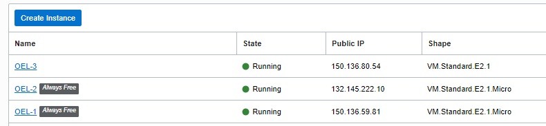
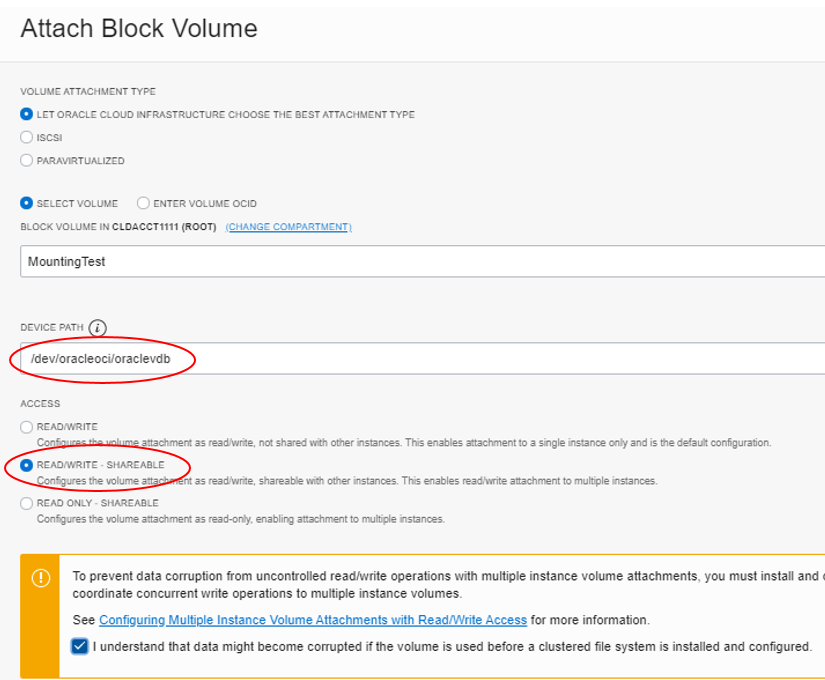
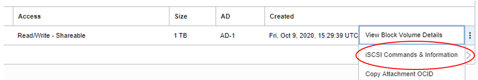
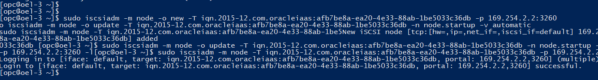
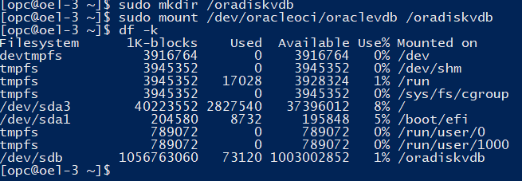

Copyright (c) 2020-2021 Oracle and/or its affiliates.  All rights reserved.

Licensed under the Universal Permissive License v 1.0 as shown at https://oss.oracle.com/licenses/upl/

## Mounting block volumes across multiple compute instances

By Rajib Ghosh, Senior Solutions Architect, Oracle for Research

This document outlines the basic and the necessary steps to mount block
volumes across multiple instances. It is recommended you test the option
by creating multiple free tier instances, cross mounting a block volume
and setting up a cluster file system. The steps are illustrated below.

1.  Create a set of compute instances (preferably free tier to save on
    cost during testing)

2.  Create a block volume taking the default options (Menu Block storage
    Block volumes)
3.  Attach the block volume to the instances (Menu->Compute Instances->Instance Details->Attached block volume).
Mount the volume with Read/Write -- Shareable and select a device path (i,e /dev/oracleoci/oraclevdb)

4.  Once the block volume is attached to all the instances, login to the
    instances and mount the volume to the instances from Linux as shown
    below

5.  Get the iSCSI commands for connecting (example shown) and run it in
    your Linux instance as shown below
sudo iscsiadm -m node -o new -T iqn.2015-12.com.oracleiaas:afb7be8a-ea20-4e33-88ab-1be5033c36db -p 169.254.2.2:3260
sudo iscsiadm -m node -o update -T iqn.2015-12.com.oracleiaas:afb7be8a-ea20-4e33-88ab-1be5033c36db -n node.startup -v automatic
sudo iscsiadm -m node -T iqn.2015-12.com.oracleiaas:afb7be8a-ea20-4e33-88ab-1be5033c36db -p 169.254.2.2:3260 --l

6.  Check if the iSCSI disk is mounted -- *sudo fdisk --l* You should
    get message similar to the following

Disk /dev/sdb: 1099.5 GB, 1099511627776 bytes, 2147483648 sectors
Units = sectors of 1 \* 512 = 512 bytes
Sector size (logical/physical): 512 bytes / 4096 bytes
I/O size (minimum/optimal): 4096 bytes / 1048576 bytes

7.  Update /etc/fstab as follows -- *sudo vi /etc/fstab* and add the
    following lines --
> /dev/oracleoci/oraclevdb /mnt/vol1 xfs defaults,\_netdev,nofail 0 2
>
> /dev/oracleoci/oraclevdc /mnt/vol2 xfs defaults,\_netdev,nofail 0 2
>
> /dev/oracleoci/oraclevdd /mnt/vol3 xfs defaults,\_netdev,nofail 0 2

8.  Create a Linux filesystem mount point as shown below and check it
    out if it correctly mounted

* sudo mkdir /oradiskvdb
* sudo mkfs -t ext3 /dev/oracleoci/oraclevdb
* mount /dev/oracleoci/oraclevdb /oradiskvdb
* sudo chmod 767 /oradiskvdb
* df -k

The disk /oradiskvdb should be mounted as shown above
*cd /oradiskvdb*
*touch testfile \#Creating a testfile*

9.  The file-system should be mounted and ready for read-write
    operations if the above file creation test succeeds. The files
    created from other instances should be visible as well
10. It is recommended to create xfs filesystem (instead of ext3).
11. In general, Ext3 or Ext4 is better if an
    application uses a single read/write thread and small files, while
    XFS shines when an application uses multiple read/write threads and
    bigger files. [Link
    here](https://access.redhat.com/articles/3129891#:~:text=In%20general%2C%20Ext3%20or%20Ext4,write%20threads%20and%20bigger%20files.).
 12. Also note that the above steps are required for icsci based mounts and not for the paravirtualized based mounts
 13. To remove a filesystem use 
 
 * sudo wipefs -a

#### References

1.  [Setting fstab options for block volumes using consistent device paths](https://docs.cloud.oracle.com/en-us/iaas/Content/Block/References/fstaboptionsconsistentdevicepaths.htm)
2. [Creating OCI file systems](https://unix.stackexchange.com/questions/395777/how-to-clear-ext4-filesystem-of-partition-in-arch)
3. [Attaching a block volume - end-to-end](https://oracledbwr.com/oracle-gen2-cloud-attaching-a-block-volume-to-an-instance/)
