<!-- Copyright (c) 2020-2021, Oracle and/or its affiliates -->

# Mounting block volumes across multiple compute instances

By Mike Riley - Solutions Architect, Oracle for Research

Content Updated May 2021

A block volume can be shared READ/WRITE by multiple instances (**maximum of 8 within OCI**).

However for READ/WRITE a cluster file system is required.  The information within this document  shows the OCI console screens for READ/WRITE attachment for sharing a block volume. There are also links to existing content relating to Oracle Linux and some high level commands for achieving this on Ubuntu.

The following example uses node1 & node2 and shares a block volume between them using OCFS2.
It is assumed that the 2 compute instances are already created and that they and the block volume are all within the same Availability Domain (AD).

To create the Block Volume:-

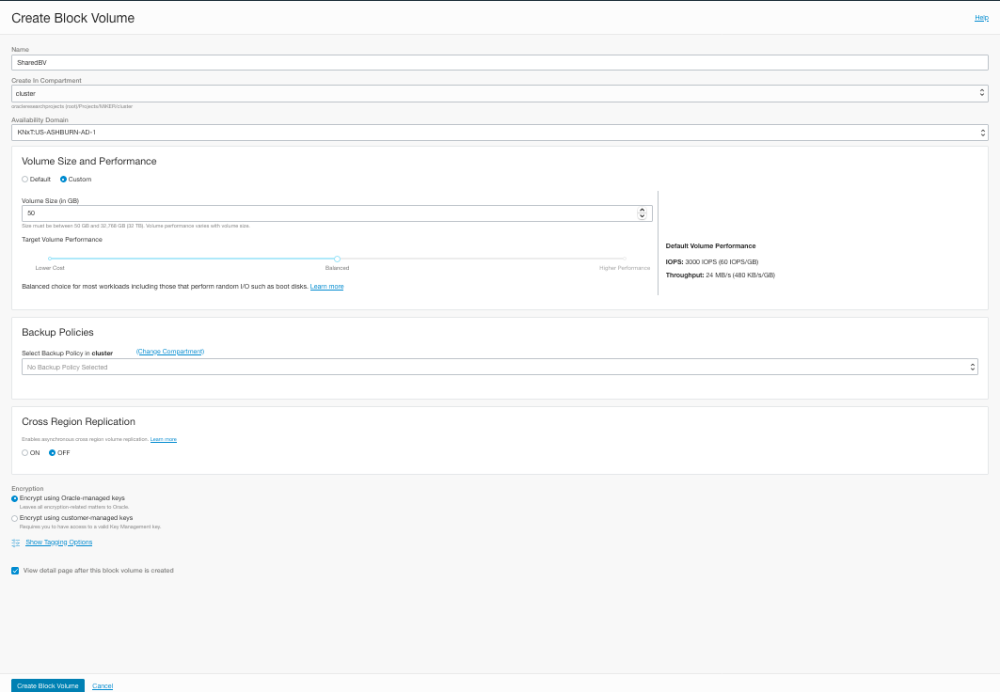

Once created the Block Volume now needs to be attached to both instances.
Note the READ/WRTE select & the acknowledgment that it is understood that a clustered file system is required.

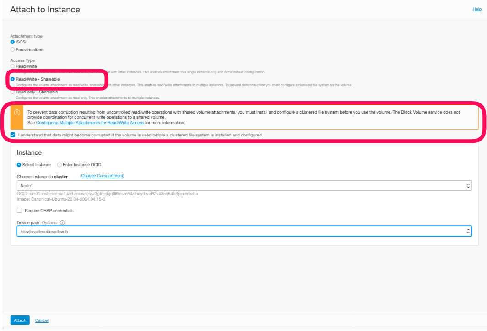

This shows volume attached to both instances
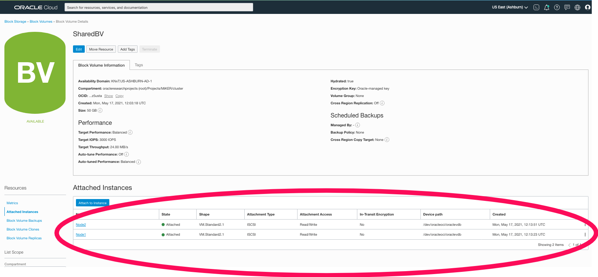

For both of these to access the volume READ/WRITE then a cluster volume HAS to be created on the volume.

[OCI Blog](https://blogs.oracle.com/cloud-infrastructure/using-the-multi-attach-block-volume-feature-to-create-a-shared-file-system-on-oracle-cloud-infrastructure)

[YouTube Video](https://www.youtube.com/watch?v=r8hjFOj9Dew)

## Brief instructions to implement OCFS2 on Ubuntu 20 are described here below

The following assumes that you have attached the shared block volume to the instances - see the previous screenshots for attaching READ/WRITE to multiple instances.

1. Allow Ingress Rules within VCN - for example within the subnet ensure ports 7777 & 3260 allow traffic.
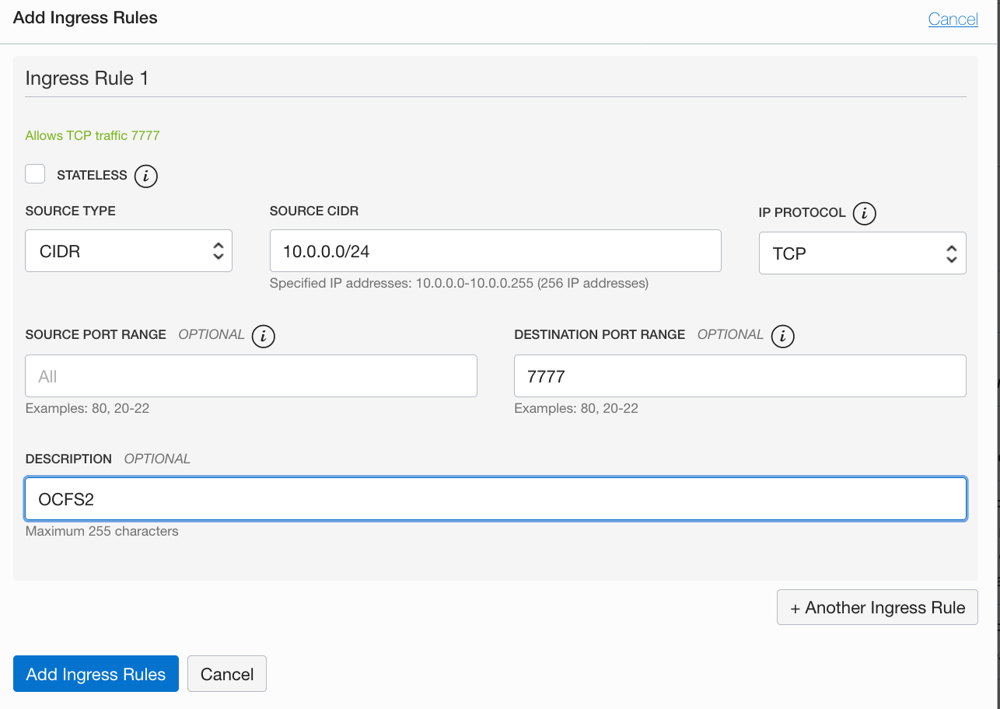


2. Run the isci commands on all nodes. The commands can be seen from the attached block volume instances.
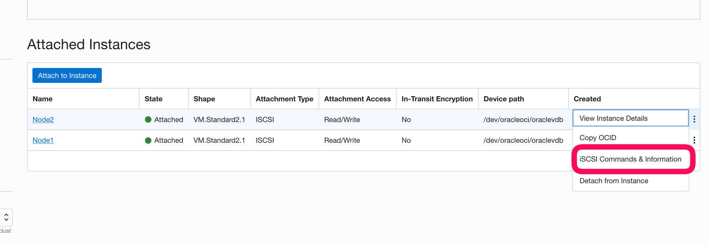
Copy these commands & run them on BOTH instances.
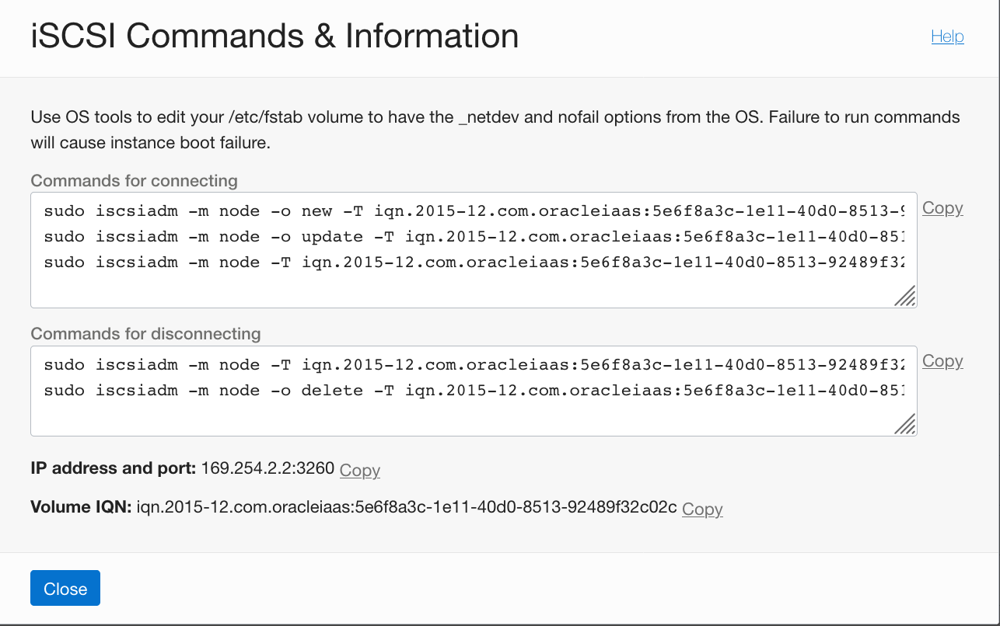

3. Change the firewall on BOTH node.

```shell
sudo iptables -I INPUT -m state --state NEW -p tcp --destination-port 7777 -j ACCEPT
sudo iptables -I INPUT -m state --state NEW -p tcp --destination-port 3260 -j ACCEPT
sudo su - 
iptables-save > /etc/iptables/rules.v4
```

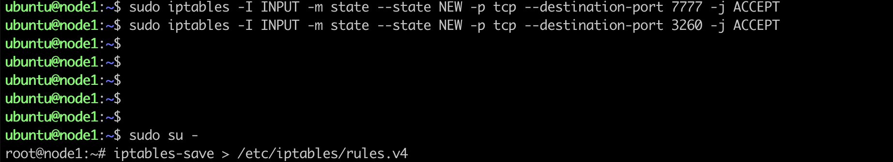

4. On all nodes run.

```shell
sudo apt-get install ocfs2-tools
```

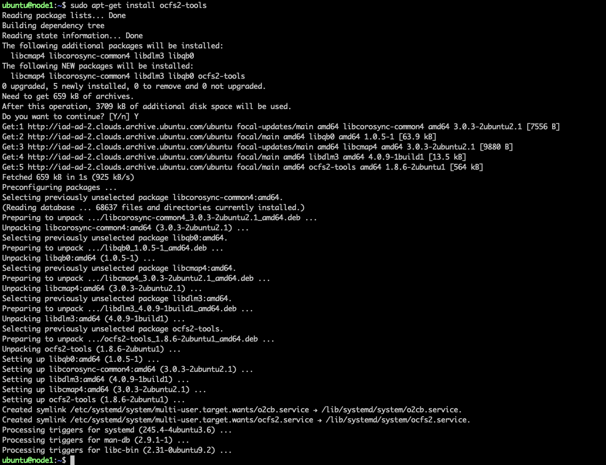

5. Edit /etc/hosts on ALL nodes

Place short node names & FQDN (retrieve from the oci console main page for each instance). The FQDN can be found from the console for each instance.

```shell
sudo vi /etc/hosts
```


6. edit the /etc/ocfs2/cluster.conf file on ALL nodes.

change this file on both nodes - ensuring IP address, node short names match your configuration

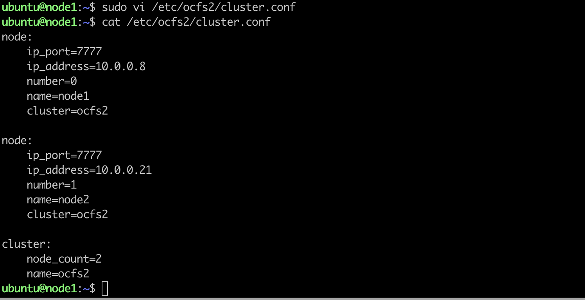

7. edit the o2cb file on BOTH nodes.

    change
    O2CB_ENABLE to true
    O2CB_BOOTCLUSTER=ocfs2

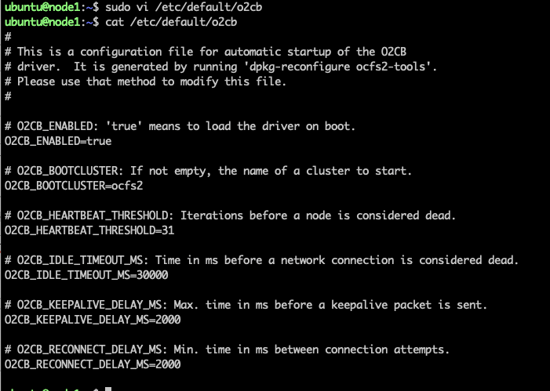

8. Restart the OCFS services on ALL nodes.

```shell
sudo service o2cb restart
sudo service ocfs2 restart
```


9. Create a directory on ALL nodes.

```shell
sudo mkdir /data-share
```


10. On one of the nodes make an OCFS2 file system on the block volume

make a OCFS2 file system - ONLY required on ONE of the nodes.
Note for this worked example the device name allocated when block volume was shared was /dev/sdb.
This can also be seen at the OS level once the iscsi commands have been run by calling lsblk.

```shell
sudo mkfs.ocfs2 -L data-share /dev/sdb -N 8
```

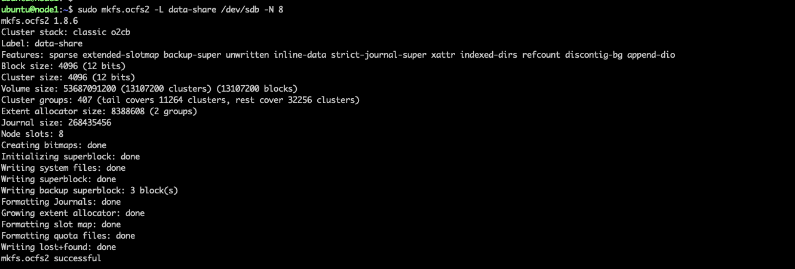

11. On ALL nodes edit fstab for the shared volume

add an entry like the one shown below e.g.

```shell
$ sudo vi /etc/fstab
/dev/sdb /data-share ocfs2     _netdev,defaults   0 0
```

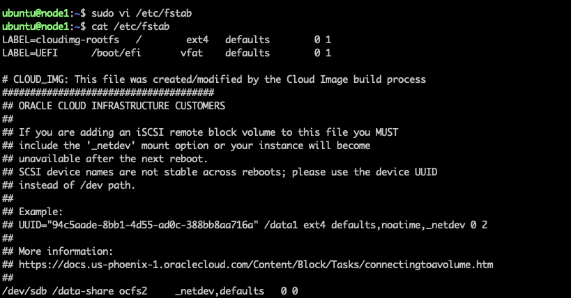

12. Now mount the OCFS2 filesystem on ALL nodes

```shell
sudo mount -a
```


## Other References

[Setting fstab options for block volumes using consistent device paths](https://docs.cloud.oracle.com/en-us/iaas/Content/Block/References/fstaboptionsconsistentdevicepaths.htm)

[Creating OCI file systems](https://unix.stackexchange.com/questions/395777/how-to-clear-ext4-filesystem-of-partition-in-arch)

[Attaching a block volume - end-to-end](https://oracledbwr.com/oracle-gen2-cloud-attaching-a-block-volume-to-an-instance/)
