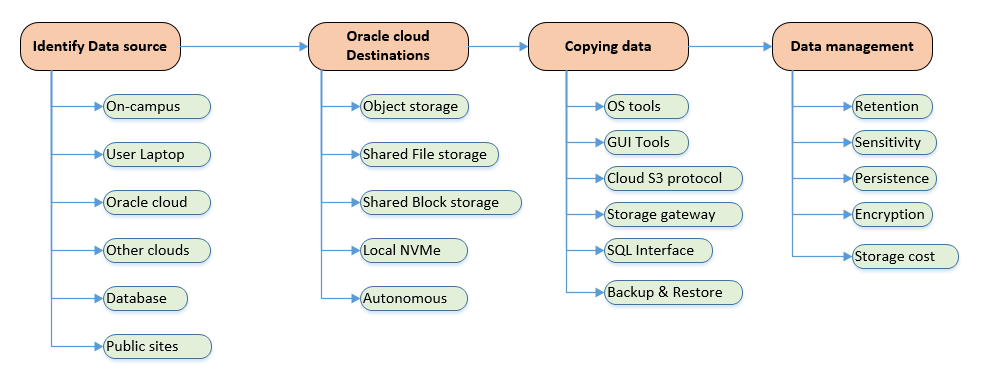

<!-- Copyright (c) 2020-2021, Oracle and/or its affiliates -->

# Moving Data to an Oracle Cloud Instance

By Rajib Ghosh - Senior Solutions Architect, Oracle for Research

Data is an essential component of research and is an integral part of all computations. However, moving data into a cloud environment can be challenging or unfamiliar. In this section, we discuss several key considerations that can help you get started on your data migration journey to Oracle cloud.

In this blog, we explain how to move data from on-campus instances or a local laptop to your Oracle Cloud tenancy. The key areas are:

* Identifying the data source and deciding to move data
* Understanding Storage options in Oracle cloud
* Copying data to Oracle cloud
* Data management considerations

## Identifying the data source and deciding to move data

* Identifying the location and volume of the data you need to move is necessary before you decide to migrate to Oracle cloud. Data can exist in one place or be distributed between your on-campus machines, researcher laptops, other clouds, databases or public sites.
* Data proximity (closeness to computational resources) and how frequently you process the data are the key decision factors for identifying data that needs to be moved to cloud. Data residency costs, security and compliancy help you decide where your data should reside.
* Oracle cloud provides various storage tiers at different costs based on data volumes, data persistency and access proximity to computational resources (i.e CPU/GPU)

## Understanding Storage options in Oracle Cloud

Oracle cloud provides the following storage options as defined below

* Oracle object storage - A large secure and encrypted storage area to upload and store files of different types. This can be visualized as a data lake and there is virtually no limit to how much data can be stored. Also, large database backups and infrequently accessed data can be archived and stored at a lower cost.

  Oracle object storage is an Oracle cloud regional service and loaded data is securely accessible with https over internet, other clouds, across OCI tenancies and from on-campus locations as well.  However, data access is faster and secure within Oracle cloud and it uses the cloud backbone to transfer data within cloud.

* File system storage – A network file system (NFS) implemented as a mountable share drive across compute or database instances. Files stored in these shares can be shared by VMs or BMs across availability domains within OCI. File system shares can also be mounted across windows and Linux instances simultaneously. Albeit at a higher cost than object storage, [file system shares](https://docs.cloud.oracle.com/en-us/iaas/Content/File/Concepts/filestorageoverview.htm#concepts) have unlimited space and offer a lower latency, better accessibility, and compute proximity.

* Attachable and shared block storage – The backbone of Oracle cloud storage infrastructure. Data stored in block storages can be shared between multiple compute instances or databases within an availability domain but cannot span between windows and Linux VM/BM instances.
  * Block storages are persistent across VM terminations and can support petabyte range storage per VM/BM instance. Block volumes also come in different categories (high performance, balanced, low cost) to match your computational performance needs and have the option to automatically switch to lower cost when not used.
  * Block volumes can support parallel concurrent writes when deployed with HPC file clusters like Lustre or BeeGFS. Block volumes scales linearly with IOPS and throughput up to a maximum limit (35000 IOPS and 480MBPS per volume). For more details you may refer to the [Block volume performance](https://docs.cloud.oracle.com/en-us/iaas/Content/Block/Concepts/blockvolumeperformance.htm#:~:text=This%20option%20provides%20the%20best,of%20480%20MBPS%20per%20volume.) page.
* NVMe Local drives – Locally attached storage that is created during instance creation. The NVMe local disks provides the highest IO bandwidth between the CPU and the disk and they are allocated as part of the BM.DenseIO and BM.HPC shapes. However, they are ephemeral in nature, so contents are wiped out as soon as the instance is terminated.
  * TIP: Use DenseIO and HPC shapes with attached NVMe local storage for IO intensive operations. For benchmarking and testing with NVMe, you may refer to [NVMe performance](https://docs.cloud.oracle.com/en-us/iaas/Content/Compute/Concepts/computeperformance.htm) pages.

* Autonomous databases – Fully functional Oracle relational database that automatically scales on CPU, RAM and storage based on your database workloads. You can also provision two [Always free autonomous](https://docs.cloud.oracle.com/en-us/iaas/Content/Database/Concepts/adbfreeoverview.htm) database instance in your tenancy as well.
  * TIP: Use Always free autonomous databases for low data intensive applications such as storing application and configuration metadata. You may also use this to record monitoring data for your instances.

## Copying data to Oracle cloud

Various data copy methods can be implemented depending upon the data sources, volume and frequency of data transferred. Some of the common scenarios and methods are described here.

* Using operating system utilities – If both your source and destination machines are Linux machines, you can use the operating system scp (secure copy) or gcp (GNU copy) over the SSH connection you establish. Some of the key steps are:

  * Establish an SSH connection
  * openssh –I <pvt_key> opc@PublicIP
  * Copy your file
  * scp AIMLData.txt opc@PublicIP /users/opc/somedir)

  * TIP: Use this for quick file transfer of smaller files directly to Oracle cloud VM.

* GUI File copy tools – Oracle cloud console provides an easy, direct and secure way to copy data into Object storage. Winscp or Cyberduck are open source tools available under the GNU license that can be used to copy file data. You can use the Object storage [Pre-authenticated requests](https://docs.cloud.oracle.com/en-us/iaas/Content/Object/Tasks/usingpreauthenticatedrequests.htm#:~:text=Pre%2Dauthenticated%20requests%20provide%20a,bucket%20without%20owning%20API%20keys.) feature to distribute access rights securely to anyone performing data copy without sharing credentials.
  * TIP: Use this if you prefer a drag and drop interactive data copy from various data sources to Oracle cloud destinations using one tool.

* From other clouds and public sites – The data can be copied following the cloud standard S3 interface. Both Winscp and Cyberduck has S3 support. [rclone](https://rclone.org/) can be used if you prefer a batch mode of file data transfer with multi-part file copy.

* Using storage gateway – Storage gateway provides a file interface to Linux mount points and Windows drives over S3 to the Oracle object store. This is useful if you perform file copies frequently. It requires a one-time installation of the storage gateway client to your data source

* Using SQL Interface for databases – SQL based data transfer using SQL Developer or bulk data import tools like Oracle data pump can be used to transfer data directly from an external database to Oracle Autonomous databases. Database backup and restore is also another way to transfer the entire database quickly. Use SQL Developer only when you need to transfer small amounts of data.

* Other ways – There are other methods of migrating on-campus databases to Oracle cloud. Some of the migration methods for Oracle databases can be found [here](https://docs.cloud.oracle.com/en-us/iaas/Content/Database/Tasks/migrating.htm).

## Data management considerations

Effective data management is essential for computational processing and resource management. The key areas are described below –

* Data retention – Period of time that a certain volume of data needs to be stored in Oracle cloud. Data that never requires processing does not need to be stored in the cloud - plan on storing data that will be processed during the course of your project. If you need to retain data, you may use Oracle cloud archive storage at a much lower cost.
* Data sensitivity – The data elements that contain personal or sensitive information should be protected at all times. Oracle cloud provides both secure data transfer and data storage through encryption. Data sensitivity is controlled by the researchers and can be encrypted at a data level as well. You may refer to [Oracle cloud security compliance](https://www.oracle.com/cloud/cloud-infrastructure-compliance/) for data center wise compliancy across global regions.  
* Data persistence – defines whether or not data is retained after the termination of the compute instance. For example, local NVMe drives are not persistent, so data is lost at termination. Data that is used across recurrent workload cycles needs to be persisted using block storage or object storage. Consider keeping larger data volumes in persistent storages and non-persistent, smaller data in local NVMe volumes.
* Storage cost – Storage cost is higher if the data resides close to the computational resource and lower if it is farther. You may use [Oracle storage cloud pricing](https://www.oracle.com/cloud/storage/pricing.html) and [cost estimator](https://www.oracle.com/cloud/cost-estimator.html) to decide where data should reside.
